# 🌮 Paul Marchiset - Prog et algo

Table des matières :

- [🌮 Paul Marchiset - Prog et algo](#-paul-marchiset---prog-et-algo)
  - [1 étoile](#1-étoile)
    - [Garder le vert et Échanger les canaux](#garder-le-vert-et-échanger-les-canaux)
    - [Noir et Blanc](#noir-et-blanc)
    - [Négatif et Dégradé noir et blanc](#négatif-et-dégradé-noir-et-blanc)
  - [2 étoiles](#2-étoiles)
    - [Miroir](#miroir)
    - [Bruit](#bruit)
    - [Rotation](#rotation)
    - [RGB Split](#rgb-split)
    - [Luminosité](#luminosité)
  - [3 étoiles](#3-étoiles)
    - [Cercle et Disque](#cercle-et-disque)
    - [Animation](#animation)
    - [Rosace](#rosace)
    - [Glitch](#glitch)
    - [Tri de pixel](#tri-de-pixel)
    - [Dégradé dans l'espace de couleur OkLAB](#dégradé-dans-lespace-de-couleur-oklab)
  - [4 étoiles](#4-étoiles)
    - [Mosaïque et Mosaïque Miroir](#mosaïque-et-mosaïque-miroir)
    - [Fractale de Mandelbrot](#fractale-de-mandelbrot)
    - [Dithering (tramage)](#dithering-tramage)
  - [Effets rigolos](#effets-rigolos)
    - [Matrix](#matrix)
    - [Tri](#tri)
    - [Water effect](#water-effect)

## 1 étoile

### Garder le vert et Échanger les canaux

<div style="display: flex; justify-content: start; gap: 2rem">
  <div style="display: flex; align-items: center; flex-direction: column">
    
    <i>Garder le vert</i>
  </div>
  <div style="display: flex; align-items: center; flex-direction: column">
    
    <i>Échanger les canaux</i>
  </div>
</div>

### Noir et Blanc

L'exercice du noir et blanc nous a permis de réutiliser une fonction vue en TD : la luminance qui nous permet de calculer pour chaque valeur rouge, verte et bleue de chaque pixel afin d'appliquer la couleur sur une échelle de gris.

**Luminance :**
```cpp
float luminance{0.2126f * image.pixel(x, y).r + 0.7152f * image.pixel(x, y).g + 0.0722f * image.pixel(x, y).b};
 ```

 <br>


### Négatif et Dégradé noir et blanc

<div style="display: flex; justify-content: start; gap: 2rem; height: 300px">
    <div style="display: flex; align-items: center; flex-direction: column">
        
        <i>Négatif</i>
    </div>
    <div style="display: flex; align-items: center; flex-direction: column; height: 100%">
        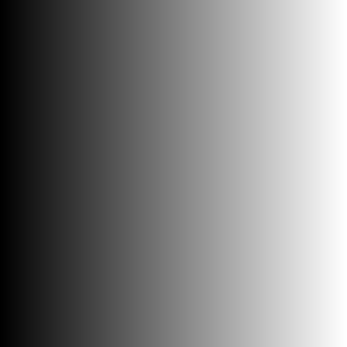
        <i>Dégradé noir et blanc</i>
    </div>
</div>

<br>

## 2 étoiles 

### Miroir

Pour créer un effet miroir sur l'axe vertical, il suffit de modifier la position en du premier pixel en X pour le mettre en position finale. Cette méthode peut créer un conflit car, lorsqu'on arrivera au milieu de l'image, on réécrira par dessus les pixels déjà copier. On obtiendra donc la moitié de l'image en miroir et le reste "normal" (voir images ci-dessous)


<div style="display: flex; justify-content: start; gap: 2rem">
    <div style="display: flex; align-items: center; flex-direction: column">
        
    </div>
    <div style="display: flex; align-items: center; flex-direction: column">
        
    </div>
</div>

<br>

Pour contrer ce problème, l'utilisation du ```std::swap``` est nécessaire pour échanger les pixels entre la position x et leur position finale.


### Bruit

Pour créer du bruit, il nous faut utiliser une valeur aléatoire entre plusieurs nombres. À chaque itération de boucle, c'est à dire, pour chaque pixel, on prend une valeur entre 0 et 2 (compris) et on définit une réponse à donner et à faire pour chaque pixel.


```cpp
switch (random_int(0, 3))
            {
            case 0:
                image.pixel(x, y).r = image.pixel(x, y).r + (rand() % 2) / 2.f;
                break;
            case 1:
                image.pixel(x, y).g = image.pixel(x, y).g + (rand() % 2) / 2.f;
                break;
            case 2:
                image.pixel(x, y).b = image.pixel(x, y).b + (rand() % 2) / 2.f;
                break;
            default:
                break;
            };
```

<br>


### Rotation

Pour cette transformation, il nous a fallu obligatoirement créer une nouvelle image. La simplicité de la transformation, nous permet de simplement récupérer l'inverser la largeur et la longueur pour la taille et ensuite d'inverser l'axe x et y sur la nouvelle image. La position x de la nouvelle image étant récupérer par la dernière position y de l'image précédente.

```cpp
new_image.pixel(new_width - 1 - y, x) = image.pixel(x, y);

```


### RGB Split

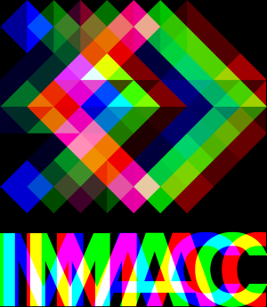

### Luminosité

<div style="display: flex; justify-content: start; gap: 2rem">
    <div style="display: flex; align-items: center; flex-direction: column">
        
    </div>
    <div style="display: flex; align-items: center; flex-direction: column">
        
    </div>
</div>

<br>

## 3 étoiles

### Cercle et Disque

Il nous faut d'abord définir la position centrale du cercle, sinon il prendra pour centre un coin de l'image.

En utilisant l'égalité mathématique : x² + y² = r² on arrive simplement à colorer des pixels blancs dont la position au carré est inférieur ou égal au rayon au carré.

```cpp
double calculus{pow(x - centreX, 2) + pow(y - centreY, 2)};
    if (calculus <= pow(rayon, 2))
    {
        image.pixel(x, y) = glm::vec3{1};
    };

```
<br>

<div style="display: flex; justify-content: start; gap: 2rem">
    <div style="display: flex; align-items: center; flex-direction: column">
        
        <i>Disque</i>
    </div>
    <div style="display: flex; align-items: center; flex-direction: column">
        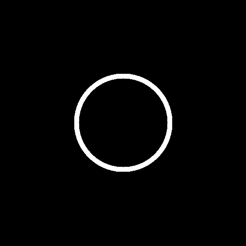
        <i>Cercle</i>
    </div>
</div>

### Animation

Pour animer le cercle, une translation sur X est effectuée en changeant la position centrale (centreX et centreY) afin de créer plusieurs images (24) et de les combiner ensemble pour faire un .gif

Malgré plusieurs essaies pour écrire un mot dessus à l'aide de OpenCV, je n'ai pas réussi à utiliser cette librairie :C

### Rosace

Une rosace est composée de plusieurs cercles dont le centre est situé sur le contour d'un cercle central.

Si on considère n comme le nombre de cercles présent dans notre rosace, alors, pour trouver le centre des autres cercles on réalise une rotation de 
$$
\frac{2\pi }{n}
$$

Pour trouver les nouvelles valeurs de x et y, centre de notre nouveau cercle de rayon r et avec pour i le nombre d'itérations de la rotation à effectuer.  On peut réaliser les deux calculs suivant :

$$
x\:=\:r\:\cdot \:cos\left(iterations\:\cdot \:\frac{2\pi }{n}\right)
$$

$$
y\:=\:r\:\cdot \:sin\left(iterations\:\cdot \:\frac{2\pi }{n}\right)
$$

<br>

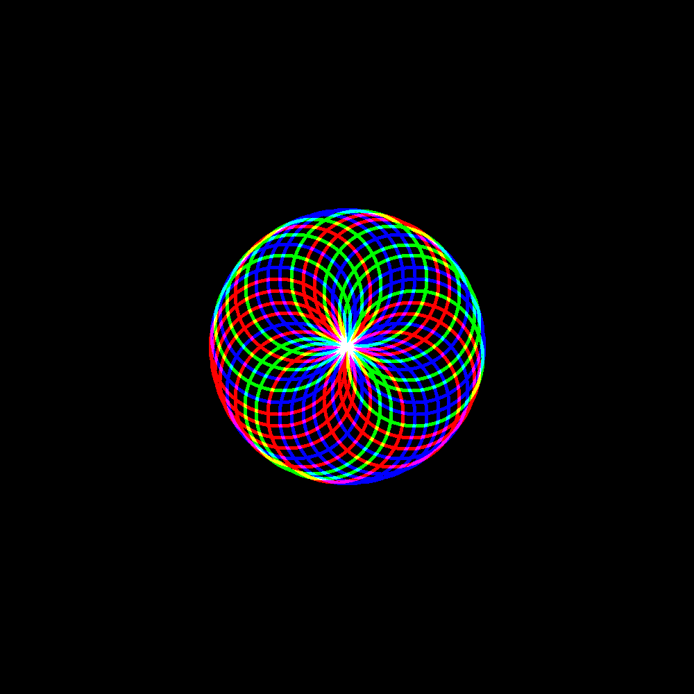

### Glitch

Avec deux positions aléatoires x et y, ainsi que deux tailles en largeur et en hauteur, on swap les deux rectangles de mêmes tailles sur l'image un nombre de fois aléatoire afin de créer un effet de "glitch" 


```cpp
for (int x = 0; x < rectangleWidth; x++)
    {
        for (int y = 0; y < rectangleHeight; y++)
        {
            std::swap(image.pixel(positionRectangleX1 + x, positionRectangleY1 + y), image.pixel(positionRectangleX2 + x, positionRectangleY2 + y));
        }
    }
```

### Tri de pixel

Pour trier des pixels, j'ai eu plusieurs idées qui n'ont pas été très fructueuses [voir tri fail](#tri). Mais il m'est venu une idée plutôt intéressante.

Si je reprends l'algorithme précédent (utilisé pour le glitch), qu'au lieu de swap deux rectangles de même tailles. Je définis un rectangle d'hauteur 1px dans un endroit aléatoire de l'image et que je ```std::sort``` les pixels de couleurs par luminance, alors je peux trier mes pixels.


### Dégradé dans l'espace de couleur OkLAB

Malheureusement, cet algorithme ne produit pas l'effet escompté. Alors qu'il crée facilement un dégradé de couleur dans l'espace sRGB :

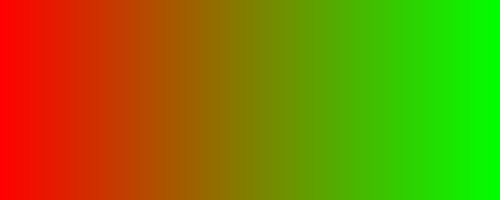

Le passage à travers les calculs pour être converti vers XYZ et LAB puis pour être reconverti dans l'autre sens ne changent rien au dégradé. Je pense que j'ai fait quelques erreurs sur l'algorithme de couleurs soit sur les valeurs de base des couleurs, soit sur la conversion inverse.

## 4 étoiles 

### Mosaïque et Mosaïque Miroir

En agrandissant la taille de l'image par un nombre N de fois (5 dans mon cas) et en créant N lignes et N colonnes, on va répéter l'image N² fois pour l'effet mosaïque. Par ailleurs, cette méthode nous fait traverser 4 boucles for.

```cpp
for (int i{0}; i < rows; i++)
    {
        for (int j{0}; j < cols; j++)
        {
            for (int x{0}; x < image.width(); x++)
            {
                for (int y{0}; y < image.height(); y++)
                {
                    new_image.pixel(x + i * image.width(), y + j * image.height()) = image.pixel(x, y);
                }
            }
        }
    }
```


Enfin, pour l'effet de miroir, j'ai décider de chercher mes lignes paires et mes colonnes paires afin que lorsque je décide de poser mes pixels, je peux simplement les placer "à l'envers" sur l'axe x ou y au choix (x pour les lignes et y pour les colonnes). 

Cette technique nécessite de penser aux cas qui sont sur les lignes et les colonnes qui eux rentreront dans l'un ou l'autre des cas mais qui nécessite normalement une transformation miroir sur l'axe x ET y.

On prévoit simplement un cas spécial pour ces derniers et nous pouvons atteindre notre objectif.


### Fractale de Mandelbrot

Pour réaliser une fractale de Mandelbrot, il nous faut rentrer dans le monde incroyable des *nombres complexes*.

On définit deux nombres complexes : ```c``` et ```z``` qui seront associés ensemble à un calcul selon une boucle. Quand z atteint 2 ou que le nombre d'itérations max est atteint, le pixel est coloré en blanc, sinon il est coloré en noir.

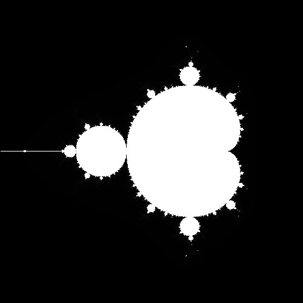

### Dithering (tramage)

L'effet du tramage demande quelques subtilités. Notamment l'utilisation de matrices. Notre objectif étant d'utiliser une matrice de Bayer, afin de réduire le nombre de pixel (surtout pour réduire le nombre de couleurs en utilisant une image en nuance de gris) et de les colorer en noir ou en blanc selon si la somme de leur luminance et de la matrice est supérieure ou égale à un gris moyen.

Ici, j'ai décidé de créer la matrice de Bayer par moi même sans utiliser une matrice déjà faite. J'ai eu à apprendre comment fonctionnait une matrice, et j'ai décider d'utiliser des tableaux de vecteurs pour la créer en imbriquant plusieurs tableaux les uns dans les autres afin de créer cette dernière.

Après plusieurs oublis de valeurs à calculer (et la super aide de Jules), je suis parvenu à pouvoir créer des matrices de tailles différentes en laissant à l'utilisateur le choix de la taille de sa matrice.

```cpp
for (int i = 0; i < size; ++i)
    {
        for (int j = 0; j < size; ++j)
        {
            newMatrix[i][j] = (bayerMatrix[i][j] * pow(bayerMatrix.size() * 2, 2) )  / pow(bayerMatrix.size() * 2, 2) ; //haut-gauche
            newMatrix[i][j + size] = (bayerMatrix[i][j]  * pow(bayerMatrix.size() * 2, 2) + 2) / pow(bayerMatrix.size() * 2, 2); // haut-droit
            newMatrix[i + size][j] = (bayerMatrix[i][j]  * pow(bayerMatrix.size() * 2, 2) + 3) / pow(bayerMatrix.size() * 2, 2); // bas-gauche
            newMatrix[i + size][j + size] = (bayerMatrix[i][j]  * pow(bayerMatrix.size() * 2, 2) +1 ) / pow(bayerMatrix.size() * 2, 2); // bas-droit
        }
    }
```


<div style="display: flex; justify-content: start; gap: 2rem;">
    <div style="display: flex; align-items: center; flex-direction: column">
        
        <i>Dithering 2x2</i>
    </div>
    <div style="display: flex; align-items: center; flex-direction: column">
        
        <i>Dithering 3x3</i>
    </div>
</div>

<br>

<div style="display: flex; justify-content: start; gap: 2rem;">
    <div style="display: flex; align-items: center; flex-direction: column">
        
        <i>Dithering 4x4</i>
    </div>
    <div style="display: flex; align-items: center; flex-direction: column">
        
        <i>Dithering 8x8</i>
    </div>
</div>

<br>

On se rend compte en agrandissant de plus en plus la taille de la matrice, que les changements à l'oeil nu, sur cette image sont de plus en plus difficiles à repérer.

## Effets rigolos

Pour finir, voici ici, une liste de quelques effets trouvés par hasard lorsque j'expérimentais des algorithmes.

### Matrix

Lorsque j'ai voulu créer par moi-même la matrice de Bayer afin de créer l'effet de tramage, j'ai du itérer quelques essais avant de parvenir à mon objectif de tramage final.

Voilà quelques essais.

<div style="display: flex; justify-content: start; gap: 2rem; height: 300px">
    <div style="display: flex; align-items: center; flex-direction: column; height: 100%">
        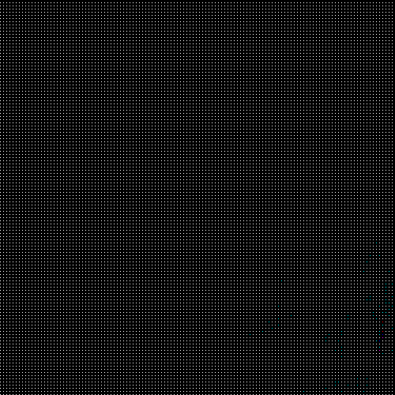
    </div>
    <div style="display: flex; align-items: center; flex-direction: column;"" >
        
    </div>
</div>

### Tri

Le tri de pixel a été itéré plusieurs fois, d'abord pensé sans utilisé sort, il a eu quelques soucis et sa première version est restée dans les mémoires, surtout après avoir utilisé mon algorithme de rotation 90.

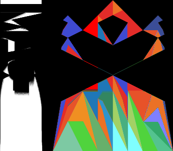

La seconde version, plus proche de la volonté finale du projet, fonctionnait mais ne donnait pas l'effet escompté.

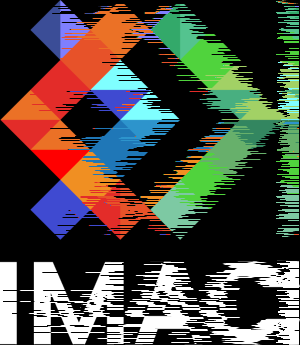

### Water effect

Ma plus grande création lorsque j'ai voulu créer l'effet de glitch.

Cet effet "goutte d'eau", subtilement nommé "Water effect" est un effet très simple où des valeurs de X et Y aléatoires  sont données en début de boucle et où la couleur d'un pixel est égale à la couleur du pixel d'à côté. Cet effet est plus efficace lorsque les changements de couleurs sont "brutes" ce qui accentue l'effet.

<div style="display: flex; justify-content: start; gap: 2rem; height: 300px">
    <div style="display: flex; align-items: center; flex-direction: column">
        
        <i>Water Effect 1</i>
    </div>
    <div style="display: flex; align-items: center; flex-direction: column">
        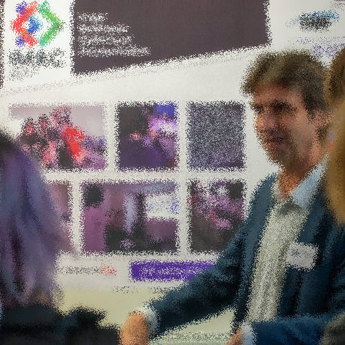
        <i>Water Effect 2</i>
    </div>
    <div style="display: flex; align-items: center; flex-direction: column">
        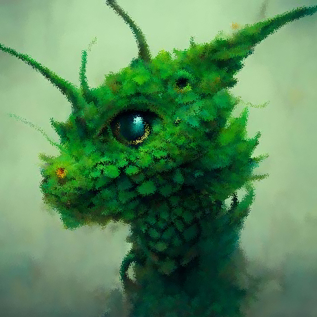
        <i>Profile picture</i>
    </div>
</div>

```cpp
int waterX{random_int(0, 5)};
int waterY{random_int(0, 5)};

if (x + waterX >= image.width())
    {
        new_image.pixel(x, y) = image.pixel(x, y);
    }

else if (y + waterY >= image.height())
    {
        new_image.pixel(x, y) = image.pixel(x, y);
    }

else
    {
        new_image.pixel(x, y) = image.pixel(x + waterX, y + waterY);
    }
```

*Voir le code dans[ src/main.cpp](src/main.cpp)*