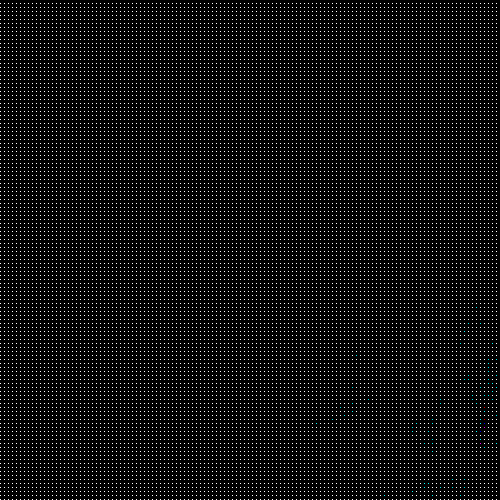
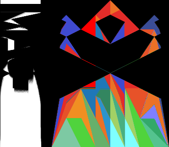
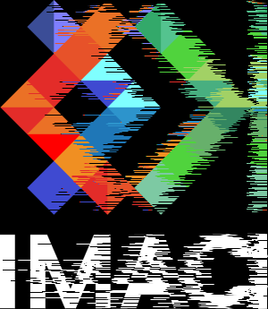
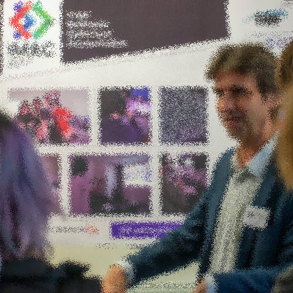
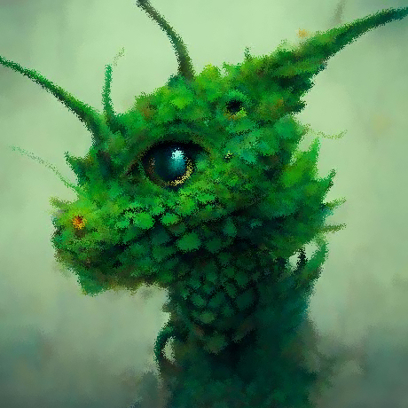

# 🌮 Paul Marchiset - Prog et algo

## 1 étoile

### Garder le vert


### Echanger les canaux


### Noir et Blanc

L'exercice du noir et blanc nous a permis de réutiliser une fonction vue en TD : la luminance qui nous permet de calculer pour chaque valeur rouge, verte et bleue de chaque pixel afin d'appliquer la couleur sur une échelle de gris.

Luminance :
```cpp
float luminance{0.2126f * image.pixel(x, y).r + 0.7152f * image.pixel(x, y).g + 0.0722f * image.pixel(x, y).b};
 ```

 <br>


### Négatif


### Dégradé noir et blanc


## 2 étoiles 

### Miroir

Pour créer un effet miroir sur l'axe vertical, il suffit de modifier la position en du premier pixel en X pour le mettre en position finale. Cette méthode peut créer un conflit car, lorsqu'on arrivera au milieu de l'image, on réécrira par dessus les pixels déjà copier. On obtiendra donc la moitié de l'image en miroir et le reste "normal" (voir images ci-dessous)


Pour contrer ce problème, l'utilisation du ```std::swap``` est nécessaire pour échanger les pixels entre la position x et leur position finale.


### Bruit

Pour créer du bruit, il nous faut utiliser une valeur aléatoire entre plusieurs nombres. À chaque itération de boucle, c'est à dire, pour chaque pixel, on prend une valeur entre 0 et 2 (compris) et on définit une réponse à donner et à faire pour chaque pixel.


```cpp
switch (random_int(0, 3))
            {
            case 0:
                image.pixel(x, y).r = image.pixel(x, y).r + (rand() % 2) / 2.f;
                break;
            case 1:
                image.pixel(x, y).g = image.pixel(x, y).g + (rand() % 2) / 2.f;
                break;
            case 2:
                image.pixel(x, y).b = image.pixel(x, y).b + (rand() % 2) / 2.f;
                break;
            default:
                break;
            };
```

<br>


### Image B

### Rotation

Pour cette transformation, il nous a fallu obligatoirement créer une nouvelle image. La simplicité de la transformation, nous permet de simplement récupérer l'inverser la largeur et la longueur pour la taille et ensuite d'inverser l'axe x et y sur la nouvelle image. La position x de la nouvelle image étant récupérer par la dernière position y de l'image précédente.

```cpp
new_image.pixel(new_width - 1 - y, x) = image.pixel(x, y);

```


## 3 étoiles

### Cercle et Disque

Il nous faut d'abord définir la position centrale du cercle, sinon il prendra pour centre un coin de l'image.

En utilisant l'égalité mathématique : x² + y² = r² on arrive simplement à colorer des pixels blancs dont la position au carré est inférieur ou égal au rayon au carré.

```cpp
double calculus{pow(x - centreX, 2) + pow(y - centreY, 2)};
    if (calculus <= pow(rayon, 2))
    {
        image.pixel(x, y) = glm::vec3{1};
    };

```
<br>


### Animation

Pour animer le cercle, une translation sur X est effectuée en changeant la position centrale (centreX et centreY) afin de créer plusieurs images (24) et de les combiner ensemble pour faire un .gif

Malgré plusieurs essaies pour écrire un mot dessus à l'aide de OpenCV, je n'ai pas réussi à utiliser cette librairie :C

### Rosace

Une rosace est composée de plusieurs cercles dont le centre est situé sur le contour d'un cercle central.

Si on considère n comme le nombre de cercles présent dans notre rosace, alors, pour trouver le centre des autres cercles on réalise une rotation de 
$$
\frac{2\pi }{n}
$$

Pour trouver les nouvelles valeurs de x et y, centre de notre nouveau cercle de rayon r et avec pour i le nombre d'itérations de la rotation à effectuer.  On peut réaliser les deux calculs suivant :

$$
x\:=\:r\:\cdot \:cos\left(iterations\:\cdot \:\frac{2\pi }{n}\right)
$$

$$
y\:=\:r\:\cdot \:sin\left(iterations\:\cdot \:\frac{2\pi }{n}\right)
$$

### Glitch

Avec deux positions aléatoires x et y, ainsi que deux tailles en largeur et en hauteur, on swap les deux rectangles de mêmes tailles sur l'image un nombre de fois aléatoire afin de créer un effet de "glitch" 


## 4 étoiles 

### Mosaïque et Mosaïque Miroir

En agrandissant la taille de l'image par un nombre N de fois (5 dans mon cas) et en créant N lignes et N colonnes, on va répéter l'image N² fois pour l'effet mosaïque. Par ailleurs, cette méthode nous fait traverser 4 boucles for.


Enfin, pour l'effet de miroir, j'ai décider de chercher mes lignes paires et mes colonnes paires afin que lorsque je décide de poser mes pixels, je peux simplement les placer "à l'envers" sur l'axe x ou y au choix (x pour les lignes et y pour les colonnes). 

Cette technique nécessite de penser aux cas qui sont sur les lignes et les colonnes qui eux rentreront dans l'un ou l'autre des cas mais qui nécessite normalement une transformation miroir sur l'axe x ET y.

On prévoit simplement un cas spécial pour ces derniers et nous pouvons atteindre notre objectif.


### Dithering (tramage)

L'effet du tramage demande quelques 

## Effets rigolos

### Matrix

Lorsque j'ai voulu créer par moi-même la matrice de Bayer afin de créer l'effet de tramage, j'ai du itérer quelques essais avant de parvenir à mon objectif de tramage final.

Voilà un des essais.



### Tri

Le tri de pixel a été itéré plusieurs fois, d'abord pensé sans utilisé sort, il a eu quelques soucis et sa première version est restée dans les mémoires, surtout après avoir utilisé mon algorithme de rotation 90.



La seconde version, plus dans la volonté finale du projet, fonctionnait mais ne donnait pas l'effet escompté.



### Water effect

Ma plus grande création lorsque j'ai voulu créer l'effet de glitch.

Cet effet "goutte d'eau", subtilement nommé "Water effect" est un effet très simple où des valeurs de X et Y random sont données en début de boucle et où la couleur d'un pixel est égale à la couleur du pixel d'à côté. Cet effet est plus efficace lorsque les changements de couleurs sont "brutes" ce qui accentue l'effet.






